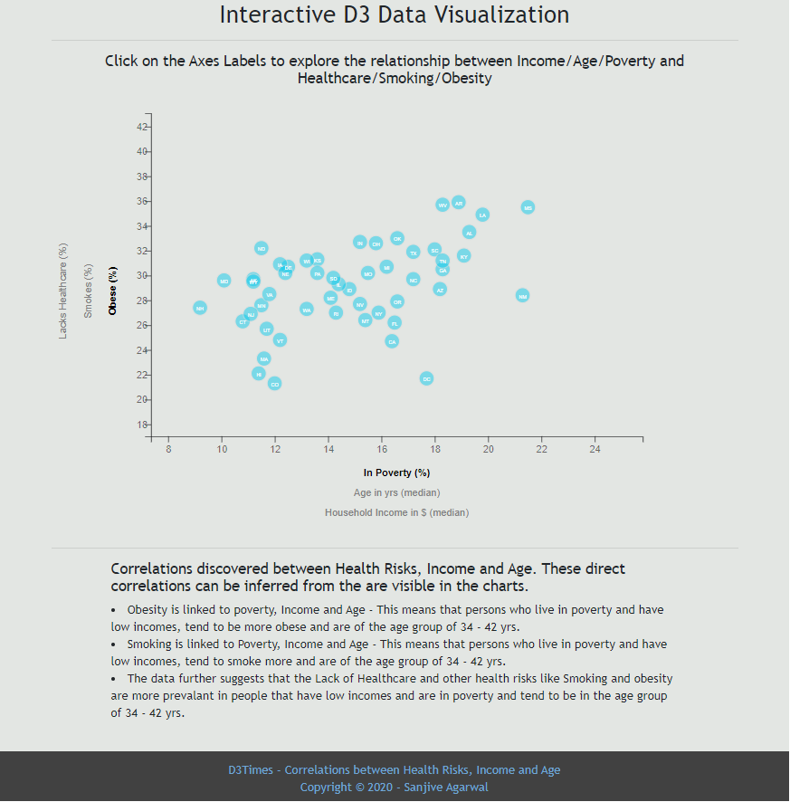

# D3 Homework - Data Journalism and D3

## Assignment details: 
### An interactive dashboard to view the Behavioral Health Risk Factor. (The data set from U.S. Census Bureau for year 2014 ACS 1-year estimate)

#### https://factfinder.census.gov/faces/nav/jsf/pages/searchresults.xhtml.
 
## Submissions:
1. Project Repository on GitHubt called `BCS_16_D3-Data-Journalism`.
2. This homeworks utilizes d3, html, Javascript and css
3. Correlations findings at the bottom of the visualization

4. Scatter Plot (with the State abbreviations in the circle) with correlations findings.

5. Dynamic Tooltip (updates as the axes change on users interaction)

6. Dynamic chart Resize (the chart resizes as the chart is enlarged or shrunk)

